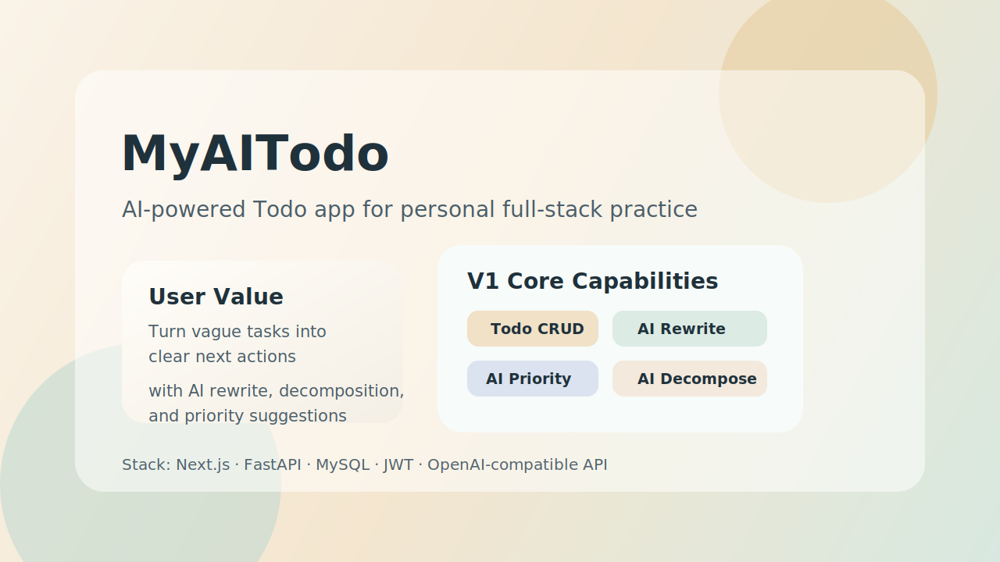

# MyAITodo

MyAITodo 是一个面向个人开发练习的 AI Todo 全栈项目，目标是完整打通从产品定义、前后端开发、数据库建模、AI 能力接入到联调测试与展示交付的全流程。



## 项目定位

- 产品类型：个人 AI Todo Web 应用
- 目标用户：个人开发者、轻量效率用户
- 核心价值：在基础任务管理之外，提供 AI 拆解、AI 重写、AI 优先级建议三项增强能力
- 项目目标：沉淀一个可运行、可展示、可继续迭代的个人全栈项目

## 当前完成情况

当前项目已完成 V1 闭环，包含：

- 用户注册与登录
- JWT 鉴权
- 个人资料维护
- Todo 创建、编辑、删除、完成
- 任务列表展示与筛选
- 基础历史记录
- AI 拆解任务
- AI 重写任务描述
- AI 优先级建议
- MySQL 持久化
- Alembic 数据库迁移体系
- 前后端真实联调与回归测试

## 技术栈

- 前端：Next.js + TypeScript
- 后端：FastAPI + SQLAlchemy + Pydantic
- 数据库：MySQL
- 认证：邮箱密码 + JWT
- AI 接口：OpenAI 兼容接口接入方式
- 部署方向：Vercel + Railway / 云服务器

## 项目结构

```text
Mytodo/
|-- frontend/        # Next.js 前端
|-- backend/         # FastAPI 后端
|-- docs/            # 项目文档
|-- runtime-logs/    # 本地运行日志
|-- AGENTS.md        # 仓库协作约定
`-- README.md
```

## 文档索引

- [项目文档索引](./docs/README.md)
- [体系架构设计文档](./docs/03-architecture-v1.md)
- [技术栈方案](./docs/04-tech-stack.md)
- [API 设计文档](./docs/05-api-design.md)
- [项目完工说明](./docs/06-project-completion.md)

## 本地运行

### 前端

```bash
cd frontend
npm install
npm run dev
```

### 后端

```bash
cd backend
..\ .venv\Scripts\python -m uvicorn app.main:app --host 127.0.0.1 --port 8000
```

### 数据库迁移

```bash
cd backend
..\ .venv\Scripts\alembic upgrade head
```

## 说明

本项目以个人开发效率和完整工程闭环为优先，不追求复杂炫技能力。后续可以继续扩展标签、提醒、子任务、批量操作、AI 调用日志与更完整的部署流水线。
