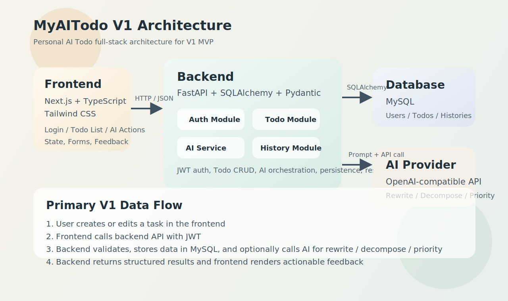

# AI Todo 项目 V1 体系结构设计文档

## 文档作者

- 主要编写者：LeeHaor / Codex
- 其他编写者：无

## 文档修改历史

| 修改人员 | 日期 | 修改原因 | 版本号 |
|---|---|---|---|
| LeeHaor / Codex | 2026-07-04 | 创建 V1 架构方案初稿 | v1.0 |

## 目录

1. 引言
2. 产品概述
3. 逻辑视角
4. 组合视角
5. 接口视角
6. 信息视角
7. V1 简化实现说明

## 1. 引言

### 1.1 编制目的

本文档用于完成 AI Todo 项目 V1 的体系结构设计，作为后续详细设计、开发实现、接口联调、测试验证和部署落地的基础依据。

本文档重点明确以下内容：

1. 前后端职责边界
2. 核心模块划分
3. 数据流转路径
4. AI 功能接入点
5. V1 简化实现策略

本文档面向个人开发执行场景，要求结构清晰、边界明确、可直接指导后续建模与编码。

### 1.2 词汇表

| 词汇名称 | 词汇含义 | 备注 |
|---|---|---|
| Todo | 用户创建的待办任务 | 系统核心业务对象 |
| AI 重写 | 对任务描述进行规范化改写 | 使任务更清晰可执行 |
| AI 拆解 | 将复杂任务拆分为多个执行步骤 | V1 核心 AI 能力 |
| AI 优先级建议 | 根据任务内容输出优先级建议 | 建议而非强制 |
| JWT | 登录态凭证 | 用于前后端鉴权 |
| PO | Persistent Object，持久化对象 | 对应数据库实体 |
| V1 | 最小可用版本 | MVP |

### 1.3 参考资料

1. AI Todo 项目目标用户与 MVP 范围定义
2. AI Todo 项目技术栈定稿
3. AI Todo 项目 Git 与开发规范约定

## 2. 产品概述

AI Todo 项目是一款面向个人用户的 AI 增强型待办管理 Web 应用。用户可以完成注册登录、创建和管理任务，并在关键节点借助 AI 获得任务重写、任务拆解和优先级建议。

V1 目标不是构建复杂协作平台，而是完成一个完整、可部署、可演示的个人 AI 全栈产品闭环：

1. 用户注册并登录
2. 用户创建、编辑、删除、完成 Todo
3. 用户在管理任务时调用 AI 能力
4. 系统保存任务与必要历史记录
5. 产品具备部署与展示基础

## 3. 逻辑视角

### 3.1 分层体系结构

项目采用前后端分离的轻量分层架构，分为四层：

1. 用户界面层：Next.js 前端，负责页面与交互
2. 业务逻辑层：FastAPI 后端，负责认证、Todo 业务、AI 编排
3. 数据访问层：SQLAlchemy + MySQL，负责数据持久化
4. 外部能力层：OpenAI 接口，负责 AI 文本生成

### 3.2 逻辑视角图



### 3.3 分层逻辑设计方案

```text
用户
  ↓
Next.js 前端
  ↓ HTTP / JSON + JWT
FastAPI 后端
  ↓
业务服务层
  ↓             ↓
MySQL        OpenAI API
```

### 3.4 前后端职责边界

#### 前端职责

1. 提供登录、任务管理、AI 调用入口和结果展示
2. 管理页面状态、加载状态、错误提示和空状态
3. 保存用户登录态并发起 API 请求
4. 呈现任务列表、编辑表单和 AI 建议结果

#### 后端职责

1. 提供统一 REST API
2. 处理认证与权限控制
3. 承担 Todo 业务逻辑与数据校验
4. 统一封装 AI Prompt、AI 调用与结果清洗
5. 写入任务、用户、历史记录等数据

#### 边界原则

1. 前端不直接访问数据库
2. 前端不直接调用模型接口
3. 所有 AI 逻辑都在后端集中管理
4. 所有业务数据都通过后端 API 入库

## 4. 组合视角

### 4.1 开发包图

#### 表1 开发包设计

| 开发(物理)包 | 依赖的其他开发包 |
|---|---|
| `frontend` | `backend API` |
| `backend` | `database`, `ai provider` |
| `docs` | 无 |
| `infra` | `frontend`, `backend`, `database` |

#### 开发包图

```text
docs

frontend
  └── depends on backend

backend
  ├── depends on mysql
  └── depends on openai api

infra/config
  ├── supports frontend
  ├── supports backend
  └── supports database
```

### 4.2 运行时进程

V1 运行时进程包括：

1. 浏览器前端进程
2. FastAPI API 进程
3. MySQL 数据库进程
4. 外部 OpenAI 服务

#### 进程图

```text
Browser
  ↕
Next.js App
  ↕ HTTP
FastAPI Server
  ↕ SQL
MySQL

FastAPI Server
  ↕ HTTPS
OpenAI API
```

### 4.3 物理部署

| 组件 | 部署方案 |
|---|---|
| 前端 | Vercel |
| 后端 | Railway |
| 数据库 | Railway MySQL |
| AI 服务 | OpenAI API |

#### 部署图

```text
用户浏览器
   ↓
Vercel Frontend
   ↓
Railway Backend
   ↓           ↓
MySQL        OpenAI API
```

## 5. 接口视角

### 5.1 模块的职责

#### 模块视图

V1 核心模块划分如下：

1. 认证模块
2. 用户资料模块
3. Todo 模块
4. AI 服务模块
5. 历史记录模块
6. 公共基础模块

#### 各层职责

**用户界面层**

- 登录注册页面
- Todo 列表与编辑页面
- AI 重写、拆解、优先级建议入口
- 用户资料页
- 异常与状态反馈

**业务逻辑层**

- 认证校验
- Todo 业务处理
- AI 调用编排
- 历史记录写入
- 统一响应格式

**数据层**

- 用户数据存储
- Todo 数据存储
- 历史记录存储
- AI 生成日志存储

#### 层之间调用接口

示例：AI 拆解任务流程

1. 前端向 `/ai/decompose` 提交任务文本
2. 后端校验身份与输入
3. 后端构造 Prompt 并调用 OpenAI API
4. 后端清洗结果并返回前端
5. 前端展示拆解建议，用户决定是否采纳

### 5.2 用户界面层的分解

#### 5.2.1 职责

V1 前端页面建议拆分为：

1. 登录页
2. 注册页
3. Todo 主页面
4. 个人资料页

Todo 主页面承担主要业务展示，包括任务列表、创建/编辑、完成切换和 AI 操作入口。

#### 5.2.2 接口规范

1. 前后端通过 REST API 通信
2. 数据格式统一为 JSON
3. 请求需携带 JWT Token
4. 响应需统一 success / error 结构
5. AI 接口返回结构化文本结果，便于直接展示

### 5.3 业务逻辑层的分解

#### 5.3.1 职责

建议按以下模块拆分后端：

1. `auth`
2. `users`
3. `todos`
4. `ai`
5. `histories`
6. `core`

#### 5.3.2 接口规范

**认证类**

- `POST /auth/register`
- `POST /auth/login`
- `GET /auth/me`

**任务类**

- `GET /todos`
- `POST /todos`
- `GET /todos/{id}`
- `PUT /todos/{id}`
- `DELETE /todos/{id}`
- `PATCH /todos/{id}/complete`

**AI 类**

- `POST /ai/rewrite`
- `POST /ai/decompose`
- `POST /ai/priority`

**用户类**

- `GET /profile`
- `PUT /profile`

**历史类**

- `GET /histories`

### 5.4 数据层的分解

#### 5.4.1 职责

数据层负责：

1. 管理数据库连接
2. 定义持久化对象与表映射
3. 执行业务数据读写
4. 保证基础事务一致性

#### 5.4.2 接口规范

V1 不强制引入复杂 Repository 模式，可采用轻量模式实现：

1. 模型定义
2. service 调用
3. 基础 CRUD
4. 必要事务控制

## 6. 信息视角

### 6.1 描述数据持久化对象（PO）

V1 至少包含以下持久化对象：

1. `User`
2. `UserProfile`
3. `Todo`
4. `TodoHistory`
5. `AiGenerationLog`

#### User

| 字段 | 含义 |
|---|---|
| id | 用户主键 |
| email | 用户邮箱 |
| password_hash | 密码哈希 |
| created_at | 创建时间 |
| updated_at | 更新时间 |

#### UserProfile

| 字段 | 含义 |
|---|---|
| id | 主键 |
| user_id | 用户 ID |
| nickname | 昵称 |
| created_at | 创建时间 |
| updated_at | 更新时间 |

#### Todo

| 字段 | 含义 |
|---|---|
| id | 主键 |
| user_id | 所属用户 |
| title | 任务标题 |
| description | 任务描述 |
| status | 待办 / 已完成 |
| priority | 用户优先级 |
| ai_rewrite_result | AI 重写结果 |
| ai_decompose_result | AI 拆解结果 |
| ai_priority_suggestion | AI 优先级建议 |
| created_at | 创建时间 |
| updated_at | 更新时间 |
| completed_at | 完成时间 |

#### TodoHistory

| 字段 | 含义 |
|---|---|
| id | 主键 |
| todo_id | 任务 ID |
| user_id | 用户 ID |
| action_type | 操作类型 |
| action_detail | 操作详情 |
| created_at | 操作时间 |

#### AiGenerationLog

| 字段 | 含义 |
|---|---|
| id | 主键 |
| user_id | 用户 ID |
| todo_id | 关联任务 ID |
| action_type | rewrite / decompose / priority |
| input_text | 输入内容 |
| output_text | 输出内容 |
| created_at | 生成时间 |

### 6.2 数据库表

V1 建议建立以下核心表：

1. `users`
2. `user_profiles`
3. `todos`
4. `todo_histories`
5. `ai_generation_logs`

#### 表关系说明

1. `users` 与 `user_profiles` 为一对一
2. `users` 与 `todos` 为一对多
3. `todos` 与 `todo_histories` 为一对多
4. `users` 与 `todo_histories` 为一对多
5. `users` 与 `ai_generation_logs` 为一对多

## 7. V1 简化实现说明

### 7.1 数据流

#### 场景一：创建普通 Todo

```text
用户输入任务
  ↓
前端表单提交
  ↓
后端 Todo 服务校验
  ↓
写入 MySQL
  ↓
返回前端展示
```

#### 场景二：AI 重写任务描述

```text
用户输入原始任务
  ↓
前端调用 AI 重写接口
  ↓
后端构造 Prompt
  ↓
调用 OpenAI API
  ↓
后端解析结果
  ↓
前端展示改写建议
  ↓
用户确认后写入 Todo
```

#### 场景三：AI 拆解任务

```text
用户选择复杂任务
  ↓
前端请求 AI 拆解
  ↓
后端调用 OpenAI API
  ↓
返回拆解后的步骤列表
  ↓
前端展示建议
```

#### 场景四：完成任务并记录历史

```text
用户点击完成
  ↓
前端调用状态更新接口
  ↓
后端更新 Todo 状态
  ↓
后端写入历史记录
  ↓
前端刷新列表
```

### 7.2 AI 功能接入点

V1 的 AI 只接入三个业务点：

1. 创建任务时可调用 AI 重写任务描述
2. 面对复杂任务时可调用 AI 拆解任务
3. 不确定先做什么时可调用 AI 优先级建议

### 7.3 哪些能力先做简单版

#### 认证先做简单版

- 只做邮箱密码注册登录
- 只做 JWT
- 不做第三方登录
- 不做找回密码

#### Todo 先做简单版

- 只做标题、描述、状态、优先级
- 不做标签系统
- 不做提醒系统
- 不做正式子任务管理
- AI 拆解结果先作为文本建议返回

#### AI 先做简单版

- 只做单轮调用
- 不做多轮对话
- 不做长期记忆
- 不做 Agent 编排

#### 历史记录先做简单版

- 只记录创建、编辑、完成、删除、AI 调用
- 不做复杂 diff 审计

#### 部署先做简单版

- 前后端分开部署
- 环境变量手动配置
- 首版不做 CI/CD

## 结论

AI Todo 项目 V1 采用 `Next.js + FastAPI + MySQL + JWT + OpenAI API + Vercel/Railway` 的轻量全栈架构，核心目标是以最低必要复杂度完成一个真实可用、可部署、可展示的 AI Todo 闭环产品。
